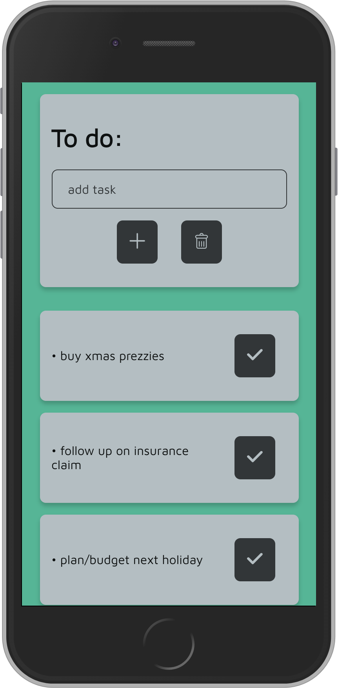

# todo_js
# to do app

Wrote a simple to-do app to strengthen my JS skills.

App is written in HTML, SASS/CSS & Vanilla JS.

Concepts applied:
* IIFE (Immediately Invokved Function Expression)
* Local Storage 
* Event Listeners
* Interaction with DOM

Biggest Challenge: learning and understanding how to implement local storage.

Favorite Part: Applying newly learnt JS concepts, building an app start to finish it and styling it! Basically all of it :P

